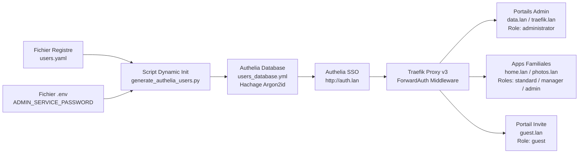

# Documentation Technique - Infrastructure OpenMediaVault HomeLab

Date de mise a jour: 12 Aout 2026 (Automation de la gestion des utilisateurs, Compte admin_service & Politique d'acces 4 Niveaux Authelia)

---

## 1. Identification de l'hote

- **Hote**: `serveur.internal`
- **OS**: Debian GNU/Linux 13 (trixie)
- **Noyau**: `7.0.10+deb13-amd64`
- **OpenMediaVault**: `8.3.1-2` (Synchrony)
- **Interface principale**: `enp4s0`
- **IPv4 hote**: `192.168.1.64/24`
- **Passerelle LAN**: `192.168.1.254` (Bbox Bouygues)
- **IP dediee Pi-hole (macvlan)**: `192.168.1.53`

---

## 2. Registre des Utilisateurs & Politique d'Acces (4 Niveaux)

La gestion des utilisateurs est entierement automatisee a partir du fichier source [`users.yaml`](file:///c:/Users/charl/Documents/code/project/openmedia/users.yaml). Au demarrage du serveur, le script Python [`scripts/generate_authelia_users.py`](file:///c:/Users/charl/Documents/code/project/openmedia/scripts/generate_authelia_users.py) compile dynamiquement la base d'utilisateurs Authelia avec hachage Argon2id.

### 2.1 Matrice des Niveaux d'Acces

| Role / Niveau | Utilisateurs Assignes | Droits & Perimetre d'Acces | Applications / Domaines Autorises |
| :--- | :--- | :--- | :--- |
| **`administrator`** | `charles.coude`, `dominique.coude`, `admin_service` | Acces total d'administration et de gestion infrastructure | `data.lan`, `traefik.lan`, `portainer.lan`, `home.lan`, `photos.lan` |
| **`manager`** | `annouk.coude` | Acces aux applications + interfaces de gestion applicative | `manager.lan`, `home.lan`, `photos.lan` |
| **`standard`** | `anne.coude`, `agathe.coude`, `hermine.coude` | Acces utilisateur standard aux applications familiales | `home.lan`, `photos.lan`, Home Assistant |
| **`guest`** | `guest_user` | Acces restreint en lecture seule | `guest.lan`, `home.lan` (vue invité) |

### 2.2 Compte de Service Systeme (`admin_service`)

Un compte de service systeme dedie `admin_service` est cree automatiquement pour l'execution des taches internes (crons de sauvegarde, API Immich, etc.) :
- Un mot de passe fort de 24 caracteres est genere aléatoirement lors du premier demarrage et sauvegarde dans la variable `ADMIN_SERVICE_PASSWORD` du fichier `.env`.
- Le compte possede le role `administrator` dans Authelia avec hachage Argon2id.

---

## 3. Architecture Reseau & Flux SSO (Authelia + Traefik ForwardAuth)



---

## 4. Structure du Projet & Automation Scripts

```text
openmedia/
├── users.yaml                      # Registre source central des utilisateurs (roles, email, phone)
├── docker-compose.yml              # Fichier Master Compose unifie
├── .env.exemple                    # Modele de configuration d'environnement global
├── stacks/
│   ├── .env                        # Variable ADMIN_SERVICE_PASSWORD et secrets actifs
│   └── 01-traefik-sso/
│       └── authelia/
│           ├── configuration.yml   # Regles d'acces 4 niveaux (administrator, manager, standard, guest)
│           ├── users_database.yml # Base Authelia compilee dynamiquement
│           └── users_credentials.json # Magasin de mots de passe temporaires idempotents
└── scripts/
    ├── generate_authelia_users.py  # Script Python de compilation dynamique et hachage Argon2id
    ├── homelab_startup.sh          # Script boot host executant la generation avant docker compose
    ├── backup_system_photos.sh     # Sauvegarde avec droits root:Famille
    ├── immich_scan_external.sh     # API REST scan des bibliotheques
    └── immich_auto_album.py        # API REST album auto "All Photos"
```

---

## 5. Guide d'Utilisation & Ajout d'un Utilisateur

Pour ajouter un nouvel utilisateur au systeme :

1. Editer le fichier [`users.yaml`](file:///c:/Users/charl/Documents/code/project/openmedia/users.yaml) :
   ```yaml
   - username: "nouvel.utilisateur"
     displayname: "Nouvel Utilisateur"
     email: "user@example.com"
     phone: "+33600000007"
     role: "standard"
   ```
2. Executer le script d'initialisation :
   ```bash
   py scripts/generate_authelia_users.py
   ```
3. Le script genere un mot de passe temporaire pour l'utilisateur dans `stacks/01-traefik-sso/authelia/users_credentials.json`, calcule son empreinte Argon2id et met a jour `users_database.yml` sans modifier les mots de passe des utilisateurs existants.
