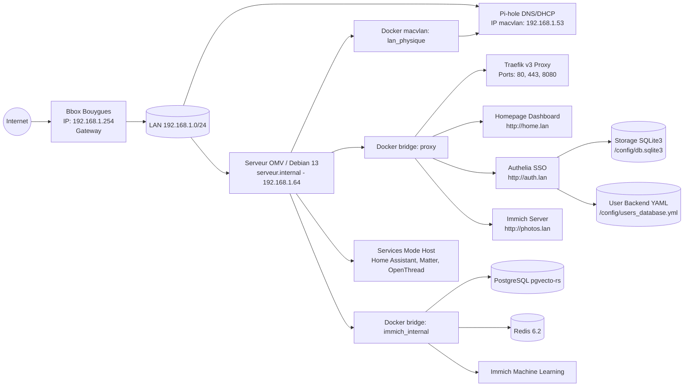
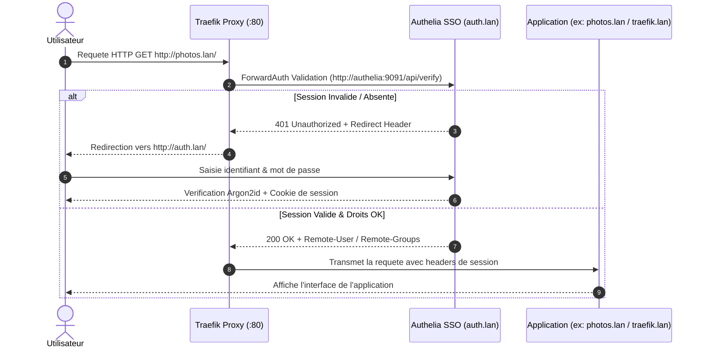

# Documentation Technique - Infrastructure OpenMediaVault HomeLab

Date de mise a jour: 12 Aout 2026 (Deploiement Authelia SSO, Homepage Google App Launcher, Harmonisation UI/UX & Restricton Administrateur)

---

## 1. Identification de l'hote

- **Hote**: `serveur.internal`
- **OS**: Debian GNU/Linux 13 (trixie)
- **Noyau**: `7.0.10+deb13-amd64`
- **OpenMediaVault**: `8.3.1-2` (Synchrony)
- **Interface principale**: `enp4s0`
- **IPv4 hote**: `192.168.1.64/24`
- **Passerelle LAN**: `192.168.1.254` (Bbox Bouygues)
- **IP dediee Pi-hole (macvlan)**: `192.168.1.53`

---

## 2. Tableau des Acces, URLs et Restrictons de Groupe

| Service | Domaine / URL | Port / Protocol | Acces & Groupe Autorise | Description |
| :--- | :--- | :--- | :--- | :--- |
| **Homepage Dashboard** | `http://home.lan` / `dash.lan` | `3000/tcp` (Traefik) | Groupe `Family` | Portail centralise style Google App Launcher / Immich |
| **Authelia SSO** | `http://auth.lan` | `9091/tcp` (Traefik) | `Bypass` (Public LAN) | Portail de connexion Single Sign-On centralise |
| **Immich Photos** | `http://photos.lan` | `2283/tcp` (Traefik) | Groupe `Family` | Gestion photos/videos (Protege par SSO Authelia) |
| **Pi-hole Admin** | `http://192.168.1.53/admin` | `53/tcp+udp` (macvlan) | LAN / Reseau local | DNS local & DHCP LAN (Theme sombre integre) |
| **Home Assistant** | `http://192.168.1.64:8123` | `8123/tcp` (host mode) | Hote / Reseau local | Centre domotique (Theme Google Material 3) |
| **Mosquitto MQTT** | `192.168.1.64:1883` | `1883/tcp` (bridge) | Hote / Reseau local | Broker MQTT pour capteurs domotiques |
| **Traefik Dashboard** | `http://traefik.lan` | `8080/tcp` / `80` | **Groupe `admin` Uniquement** | Administration Reverse Proxy (Protege par Authelia) |
| **OpenMediaVault** | `http://data.lan:81` / `192.168.1.64:81` | `81/tcp` (OMV WebGUI) | **Groupe `admin` Uniquement** | Administration NAS & Partages (Protege par Authelia) |
| **SSH Hote** | `ssh root@192.168.1.64` | `22/tcp` | `root` uniquement | Acces shell superutilisateur Debian |

---

## 3. Architecture Reseau & Flux SSO (Authelia + Traefik ForwardAuth)

### Architecture Globale du Reseau



### Sequence d'Authentification Authelia ForwardAuth



---

## 4. Single Sign-On (Authelia) & Gestion des Comptes

L'authentification centralisee repose sur **Authelia**, un portail SSO leger et autonome stocke sur disque (`./stacks/01-traefik-sso/authelia`).

### 4.1 Inventaire des Utilisateurs et Groupes (`users_database.yml`)

Les utilisateurs sont definis dans le fichier [`stacks/01-traefik-sso/authelia/users_database.yml`](file:///c:/Users/charl/Documents/code/project/openmedia/stacks/01-traefik-sso/authelia/users_database.yml) :

- **Comptes Famille (Groupe `Family`)** :
  - `charles.coude` (Charles Coudé)
  - `dominique.coude` (Dominique Coudé)
  - `annouk.coude` (Annouk Coudé)
  - `anne.coude` (Anne Coudé)
  - `agathe.coude` (Agathe Coudé)
  - `hermine.coude` (Hermine Coudé)
- **Comptes Administrateurs (Groupe `admin`)** :
  - `charles.coude`
  - `dominique.coude`

### 4.2 Regles de Controle d'Acces (`configuration.yml`)

1. `auth.lan` -> **Bypass** (Accessible publiquement sur le LAN pour le formulaire de login).
2. `home.lan` & `photos.lan` -> **one_factor** (Acces autorise aux membres du groupe `Family`).
3. `traefik.lan` & `data.lan` -> **one_factor** (Acces restreint aux membres du groupe `admin` uniquement : `charles.coude` et `dominique.coude`).

---

## 5. Unification UI/UX & Themes Graphiques

Toutes les applications de la stack ont ete harmonisees autour du style visuel **Google / Material Design 3 / Immich Glassmorphism**.

### 5.1 Homepage Portal (Google App Launcher)

Le fichier [`stacks/02-homepage/config/custom.css`](file:///c:/Users/charl/Documents/code/project/openmedia/stacks/02-homepage/config/custom.css) injecte les regles CSS suivantes :
- Fond sombre ardoise (`#0b0f19`) avec degrades radiaux subtils.
- Cartes en effet **Glassmorphism** (`backdrop-filter: blur(16px)`).
- Bords arrondis **Material Design** (`border-radius: 20px`).
- Effets d'election et d'aurore au survol (`box-shadow: 0 12px 32px -8px rgba(99, 102, 241, 0.35)`).

### 5.2 Theme Sombre Pi-hole

Le fichier de theme [`stacks/03-pihole/pihole/custom-theme.css`](file:///c:/Users/charl/Documents/code/project/openmedia/stacks/03-pihole/pihole/custom-theme.css) est monte en volume lecture seule dans `/var/www/html/admin/custom-theme.css` pour harmoniser l'interface web Pi-hole.

### 5.3 Guide d'Integration Theme Google Home Assistant

Pour appliquer le theme **Google / Material 3** dans Home Assistant :

1. Installer **HACS** (Home Assistant Community Store) si ce n'est pas deja fait.
2. Rechercher et installer le theme **"Google Theme"** ou **"Material 3"** depuis la section Frontend de HACS.
3. Dans `configuration.yaml` de Home Assistant ([`stacks/04-homeautomation/homeassistant/config/configuration.yaml`](file:///c:/Users/charl/Documents/code/project/openmedia/stacks/04-homeautomation/homeassistant/config/configuration.yaml)), s'assurer d'activer les themes :
   ```yaml
   frontend:
     themes: !include_dir_merge_named themes
   ```
4. Selectionner le theme Google dans le profil utilisateur Home Assistant.

---

## 6. Persistance des Donnees & Zero Data Loss

Chaque service Docker de l'infrastructure utilise des **bind mounts locaux** lies au disque hôte :

- Authelia Config & Base SQLite : `./stacks/01-traefik-sso/authelia:/config`
- Homepage Configuration : `./stacks/02-homepage/config:/app/config`
- Pi-hole Donnees & DNS : `./stacks/03-pihole/pihole/etc-pihole:/etc/pihole`
- Home Assistant Config : `./stacks/04-homeautomation/homeassistant/config:/config`
- Immich Uploads & Base : `./stacks/05-immich/upload` & `./stacks/05-immich/postgres`

Aucune donnee n'est perdue lors du redemarrage ou du remplacement des conteneurs.

---

## 7. Guide de Deploiement & Commandes

```bash
# 1. Preparation des variables d'environnement
cp .env.exemple .env
cp .env.exemple stacks/.env

# 2. Lancement de la stack unifiee
docker compose up -d

# 3. Verification des logs Authelia & Traefik
docker logs -f authelia
docker logs -f traefik
```
