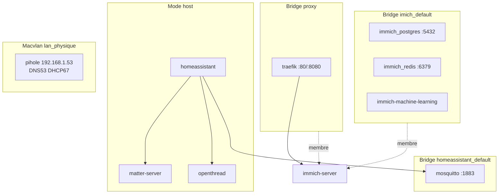
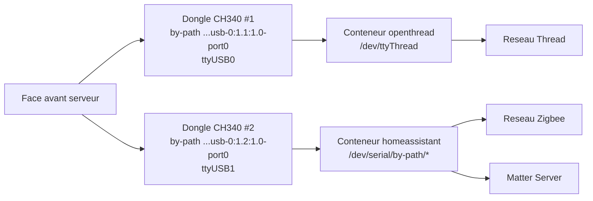
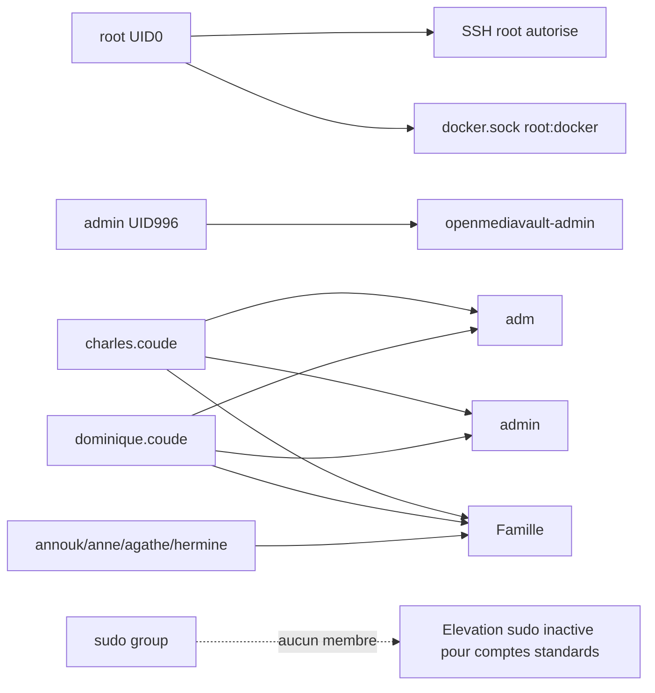

# Rapport Technique - Infrastructure OpenMediaVault

Date de mise a jour: 2026-06-25 (diagnostic SSH + fichiers de stack)

## 1. Identification de l'hote

- Hote: `serveur.internal`
- OS: Debian GNU/Linux 13 (trixie)
- Noyau: `7.0.10+deb13-amd64`
- OpenMediaVault: `8.3.1-2` (Synchrony)
- Interface principale: `enp4s0`
- IPv4 hote: `192.168.1.64/24`
- Passerelle LAN: `192.168.1.254` (Bbox Bouygues)

## 2. Acces d'administration

- URL d'administration OMV: `http://data.lan` (port `81`), HTTPS port `443`
- SSH: utilisateur `root` sur `serveur.internal`
- Compte OMV: utilisateur `admin`
- Mot de passe : `Op3nm€d1@vault`

## 3. Architecture reseau (physique + logique)

Le serveur est branche sur le LAN `192.168.1.0/24` via `enp4s0`.
La Bbox Bouygues (`192.168.1.254`) assure uniquement la passerelle Internet.
Le DNS local et le DHCP LAN sont assures par Pi-hole via un reseau Docker `macvlan` avec IP dediee `192.168.1.53`.

```mermaid
flowchart LR
  WAN((Internet)) --> BBOX[Bbox Bouygues\nIP: 192.168.1.254\nRole: Gateway uniquement]
    BBOX --> LAN[(LAN 192.168.1.0/24)]

    LAN --> HOST[Serveur OMV\nserveur.internal\n192.168.1.64\nNIC: enp4s0]
    LAN --> PIHOLE[Pi-hole\nIP macvlan: 192.168.1.53\nDNS + DHCP]

    HOST --> BRPROXY[Docker bridge: proxy\n172.19.0.0/16]
    HOST --> BRIMMICH[Docker bridge: imich_default\n172.18.0.0/16]
    HOST --> BRHA[Docker bridge: homeassistant_default\n172.21.0.0/16]
    HOST --> BRDOCKER[Docker bridge: bridge\n172.17.0.0/16 (down)]
    HOST --> BRDNS[Docker bridge: dns-pihole_default\n172.20.0.0/16 (down)]
    HOST --> MACVLAN[Docker macvlan: lan_physique\nparent enp4s0]

    BRPROXY --> TRAEFIK[Traefik\nPorts publies: 80, 8080]
    BRPROXY --> IMMICH[Immich Server\nVHost: photos.lan]
    BRIMMICH --> DB[(Postgres Immich)]
    BRIMMICH --> REDIS[(Redis Immich)]
    BRHA --> MOSQ[MQTT Mosquitto\nPort publie: 1883]
    HOST --> HAHOST[Services host network\nhomeassistant, matter-server, openthread]
    MACVLAN --> PIHOLE
```

Parametrage DHCP observe dans Pi-hole (`/etc/pihole/dnsmasq.conf`):

- `dhcp-range=192.168.1.100,192.168.1.200`
- `dhcp-option=option:router,192.168.1.254`

## 4. Inventaire des services Docker actifs

### Domotique

- `homeassistant` (network_mode: host)
- `matter-server` (network_mode: host)
- `openthread` (OTBR, network_mode: host)
- `mosquitto` (port publie `1883/tcp`)

### Reseau et acces

- `pihole` (DNS local, IP dediee `192.168.1.53` via `lan_physique` macvlan)
- `traefik` (ports publies `80/tcp` et `8080/tcp`)

### Medias

- `imich-immich-server-1` (service web Immich)
- `imich-immich-machine-learning-1` (ML Immich)
- `immich_postgres` (base de donnees)
- `immich_redis` (cache)

### Interfaces reseau des services

| Service                 | Mode/interface reseau                 | Adresse/port cle                                              |
| :---------------------- | :------------------------------------ | :------------------------------------------------------------ |
| `pihole`                | `lan_physique` (macvlan sur `enp4s0`) | `192.168.1.53`, DNS `53/tcp+udp`, DHCP `67/udp`               |
| `traefik`               | bridge `proxy`                        | publie `80/tcp`, `8080/tcp`                                   |
| `imich-immich-server-1` | bridges `imich_default` + `proxy`     | service interne `2283/tcp`, publie via Traefik (`photos.lan`) |
| `immich_postgres`       | bridge `imich_default`                | `5432/tcp` interne                                            |
| `immich_redis`          | bridge `imich_default`                | `6379/tcp` interne                                            |
| `homeassistant`         | `network_mode: host`                  | ports hote (expose notamment `8123/tcp`)                      |
| `matter-server`         | `network_mode: host`                  | services Matter sur pile reseau hote                          |
| `openthread`            | `network_mode: host`                  | API OTBR + acces radio `/dev/ttyThread`                       |
| `mosquitto`             | bridge `homeassistant_default`        | publie `1883/tcp`                                             |



## 5. Domotique radio: cles USB Thread/Zigbee (face avant)

Deux adaptateurs USB serie CH340 sont detectes et exposes dans `/dev/serial/by-path`.

- Cle 1 (Thread OTBR):
  - Chemin physique stable: `/dev/serial/by-path/pci-0000:00:1a.0-usb-0:1.1:1.0-port0`
  - Lien noyau: `ttyUSB0`
  - Usage: mappee dans le conteneur `openthread` vers `/dev/ttyThread`
- Cle 2 (Zigbee Home Assistant):
  - Chemin physique stable: `/dev/serial/by-path/pci-0000:00:1a.0-usb-0:1.2:1.0-port0`
  - Lien noyau: `ttyUSB1`
  - Usage: acces via montage global `/dev/serial/by-path` dans `homeassistant`

Identifiants USB detectes:

- `1a86:7523` QinHeng Electronics CH340 serial converter (x2)



## 6. Stockage et points de montage

| Peripherique | Capacite approx. | Type             | Montage                                  | Role                           |
| :----------- | :--------------- | :--------------- | :--------------------------------------- | :----------------------------- |
| `/dev/sda2`  | ~1 To            | ext4             | `/`                                      | Systeme Debian + Docker        |
| `/dev/sdc1`  | ~1.8 To          | ntfs (`fuseblk`) | `/srv/dev-disk-by-uuid-52E654B8E6549E53` | Photos famille / export Immich |
| `/dev/sdb2`  | ~3.6 To          | ntfs (`fuseblk`) | `/srv/dev-disk-by-uuid-7AF2DC71F2DC335D` | Sauvegardes                    |

Utilisation observee:

- `/` a ~10% d'occupation
- `/srv/dev-disk-by-uuid-52E654B8E6549E53` a ~70% d'occupation
- `/srv/dev-disk-by-uuid-7AF2DC71F2DC335D` a ~84% d'occupation

## 7. Sauvegardes planifiees

- Sauvegarde systeme quotidienne (05:00) en archive compressee vers `sdb`
- Synchronisation photo incrementale (05:30) via `rsync`:
  - source photos (sdc) -> cible sauvegardes (sdb)
  - source Immich (sda) -> cible sauvegardes (sdb)

## 8. Reseaux Docker detectes

- `lan_physique` (macvlan, parent `enp4s0`) - IP dediee Pi-hole
- `proxy` (bridge)
- `imich_default` (bridge)
- `homeassistant_default` (bridge)
- `dns-pihole_default` (bridge)
- `bridge` (bridge par defaut)
- `host`, `none`

## 9. Utilisateurs du serveur et droits

### Comptes identifies

- Compte superutilisateur: `root` (UID 0)
- Compte administration Web OMV: `admin` (UID 996, groupe `openmediavault-admin`)
- Comptes utilisateurs shell: `charles.coude`, `annouk.coude`, `anne.coude`, `agathe.coude`, `hermine.coude`, `dominique.coude`

### Groupes et privileges observes

- `openmediavault-admin`: membre `admin` (administration interface OMV)
- `admin` (groupe local): membres `charles.coude`, `dominique.coude`
- `Famille`: membres `charles.coude`, `annouk.coude`, `anne.coude`, `agathe.coude`, `hermine.coude`, `dominique.coude`
- `adm`: membres `charles.coude`, `dominique.coude`
- Groupe `sudo`: existe, mais aucun membre direct observe
- Docker socket: `/var/run/docker.sock` est `root:docker` (`srw-rw----`) et le groupe `docker` est vide (controle Docker effectif reserve a `root`)

### Controle d'acces SSH et elevation

- `PermitRootLogin yes`
- `PasswordAuthentication yes`
- Regles sudo par defaut presentes:
  - `root ALL=(ALL:ALL) ALL`
  - `%sudo ALL=(ALL:ALL) ALL`


