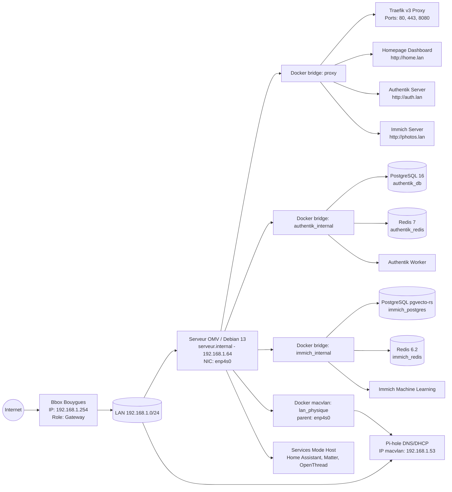
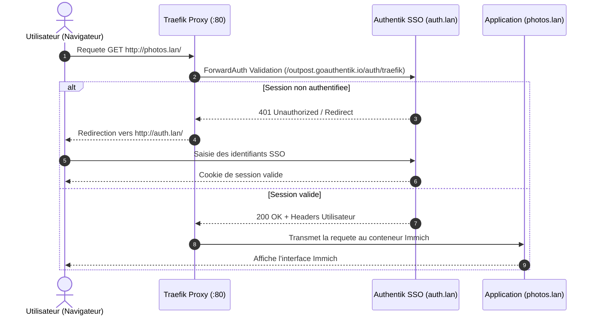

# Documentation Technique - Infrastructure OpenMediaVault HomeLab

Date de mise a jour: 12 Aout 2026 (Refonte architecturale: Docker Compose unifie/modulaire, Authentik SSO, Homepage Dashboard, Scripts d'automatisation & Systemd)

---

## 1. Identification de l'hote

- **Hote**: `serveur.internal`
- **OS**: Debian GNU/Linux 13 (trixie)
- **Noyau**: `7.0.10+deb13-amd64`
- **OpenMediaVault**: `8.3.1-2` (Synchrony)
- **Interface principale**: `enp4s0`
- **IPv4 hote**: `192.168.1.64/24`
- **Passerelle LAN**: `192.168.1.254` (Bbox Bouygues)
- **IP dediee Pi-hole (macvlan)**: `192.168.1.53`

---

## 2. Tableau des Acces et Services

| Service | Domaine / URL | Port / Protocol | Description & Authentication |
| :--- | :--- | :--- | :--- |
| **Homepage Dashboard** | `http://home.lan` / `dash.lan` | `3000/tcp` (Traefik) | Tableau de bord centralise au design sombre / glassmorphism |
| **Authentik SSO** | `http://auth.lan` | `9000/tcp` (Traefik) | Fournisseur d'identite et SSO pour tous les services exposes |
| **Immich Photos** | `http://photos.lan` | `2283/tcp` (Traefik) | Serveur de gestion photos/videos (protege par SSO Authentik) |
| **Traefik Dashboard** | `http://traefik.lan` | `8080/tcp` / `80` / `443` | Reverse proxy dynamique HTTP/HTTPS |
| **Pi-hole Admin** | `http://192.168.1.53/admin` | `53/tcp+udp` (macvlan) | Serveur DNS local & DHCP LAN (`192.168.1.100-200`) |
| **Home Assistant** | `http://192.168.1.64:8123` | `8123/tcp` (host mode) | Centre d'automatisation domotique |
| **Mosquitto MQTT** | `192.168.1.64:1883` | `1883/tcp` (bridge) | Broker de messages MQTT pour objets connectes |
| **Matter Server** | Local container (host) | Host network | Serveur de controle des equipements domotiques Matter |
| **OpenThread OTBR** | Local container (host) | Host network | Routeur de bordure Thread (antenne USB `/dev/ttyThread`) |
| **OpenMediaVault** | `http://data.lan:81` / `192.168.1.64:81` | `81/tcp` (OMV WebGUI) | Administration NAS & partages de fichiers |
| **SSH Hote** | `ssh root@192.168.1.64` | `22/tcp` | Acces shell superutilisateur Debian |

---

## 3. Architecture Reseau & Flux SSO

Le serveur est branche sur le LAN `192.168.1.0/24` via l'interface `enp4s0`.  
La Bbox Bouygues (`192.168.1.254`) assure uniquement la passerelle Internet.  
Le DNS local et le DHCP LAN sont assures par Pi-hole via le reseau Docker `macvlan` sur l'IP dediee `192.168.1.53`.  
La securite et l'acces aux applications web (Immich, Homepage) sont centralises par **Traefik v3** et le middleware **ForwardAuth Authentik**.

### Architecture Globale du Reseau



### Flux d'Authentification Single Sign-On (Authentik ForwardAuth)



---

## 4. Organisation du Projet & Stacks Docker

L'architecture Docker du projet a ete refondue pour etre modulaire, maintenable et compatible a la fois avec `docker compose` en CLI et des outils d'orchestration comme Dockge.

### Structure du Repertoire

```text
openmedia/
├── docker-compose.yml              # Fichier Master unifie (tous les services)
├── .env.exemple                    # Modele de variables d'environnement globales
├── .gitignore                      # Regles d'exclusion Git
├── readme.md                       # Documentation technique
├── changes.md                      # Historique des evolutions et refontes
├── stacks/                         # Stacks moduliares autonomes
│   ├── .env                        # Configuration active des variables d'environnement
│   ├── docker-compose.yml          # Mirror du master compose pour exécution depuis stacks/
│   ├── 01-traefik-sso/             # Traefik v3 + Authentik SSO (Server, Worker, DB, Redis)
│   ├── 02-homepage/                # Homepage Dashboard + CSS glassmorphism & configs
│   ├── 03-pihole/                  # Pi-hole DNS/DHCP (Macvlan)
│   ├── 04-homeautomation/          # Home Assistant, Matter, OpenThread, Mosquitto
│   └── 05-immich/                  # Immich Photos, ML, Redis, Postgres pgvecto-rs
├── scripts/                        # Scripts d'automatisation et de gestion systeme
│   ├── homelab_startup.sh          # Script de demarrage Plug & Play (reseaux + compose)
│   ├── homelab-stacks.service      # Unite systemd d'autostart au boot
│   ├── backup_system_photos.sh     # Sauvegarde archive systeme + rsync photos + droits
│   ├── immich_scan_external.sh     # Trigger scan API REST des bibliotheques externes
│   └── immich_auto_album.py        # Indexation Python des photos non classees
└── crons/
    └── homelab_crontab.snippet     # Modele de configuration crontab pour l'hote
```

### Inventaire des Services par Stack

1. **`01-traefik-sso`** :
   - `traefik`: Reverse proxy edge avec rechargement dynamique des regles (`/etc/traefik/dynamic`).
   - `authentik-server` & `authentik-worker`: Coeur de la solution Single Sign-On (image `goauthentik/server:2024.12.1`).
   - `authentik-db`: Base de donnees PostgreSQL 16 dédiée.
   - `authentik-redis`: Cache de session Redis 7.

2. **`02-homepage`** :
   - `homepage`: Dashboard unifie personnalise avec style sombre glassmorphic (`custom.css`), cartes dynamiques (`services.yaml`) et widgets en temps reel.

3. **`03-pihole`** :
   - `pihole`: Serveur DNS/DHCP connecte directement au LAN physique via le driver `macvlan` sur l'IP `192.168.1.53`.

4. **`04-homeautomation`** :
   - `homeassistant`: Serveur domotique en `network_mode: host` avec acces privilegie aux peripheriques USB Zigbee.
   - `matter-server`: Pile de controle des appareils Matter (`network_mode: host`).
   - `openthread`: Border router Thread (OTBR) mappant `/dev/serial/by-path/...` vers `/dev/ttyThread`.
   - `mosquitto`: Broker MQTT publie sur le port `1883/tcp`.

5. **`05-immich`** :
   - `immich-server` & `immich-machine-learning`: Traitement et serveur web de photos/videos.
   - `immich-postgres`: Base PostgreSQL 14 equipee de l'extension de recherche vectorielle `pgvecto-rs`.
   - `immich-redis`: Base de cache interne Redis 6.2.

---

## 5. Domotique Radio : Cles USB Thread & Zigbee

Les adaptateurs USB serie CH340 sont identifies et montes via leurs chemins physiques stables (`/dev/serial/by-path`).

- **Cle 1 (Thread OTBR)**:
  - Chemin physique: `/dev/serial/by-path/pci-0000:00:1a.0-usb-0:1.1:1.0-port0`
  - Lien conteneur: Mappee dans `openthread` vers `/dev/ttyThread` (vitesse `230400`)
- **Cle 2 (Zigbee Home Assistant)**:
  - Chemin physique: `/dev/serial/by-path/pci-0000:00:1a.0-usb-0:1.2:1.0-port0`
  - Lien conteneur: Acces direct via montage dans `homeassistant`

---

## 6. Stockage et Points de Montage

| Peripherique | Capacite | FSType | Montage Hote | Role dans la Stack |
| :--- | :--- | :--- | :--- | :--- |
| `/dev/sda2` | ~1 To | ext4 | `/` | OS Debian 13, Docker, bases de donnees et configurations |
| `/dev/sdc1` | ~1.8 To | ext4 / ntfs | `/srv/dev-disk-by-uuid-52E654B8E6549E53` | Stockage principal des photos de famille & export Immich |
| `/dev/sdb2` | ~3.6 To | ext4 / ntfs | `/srv/dev-disk-by-uuid-7AF2DC71F2DC335D` | Disque de sauvegarde (Archives systeme `.tar.gz` & Synchro photos `rsync`) |

---

## 7. Automatisation, Services & Crons

### 7.1 Service de Demarrage Automatique (Plug & Play Boot)

Le demarrage de l'infrastructure est automatise par un service `systemd` sur l'hote :

- **Script de demarrage** : [`scripts/homelab_startup.sh`](file:///c:/Users/charl/Documents/code/project/openmedia/scripts/homelab_startup.sh)
  - Attend que le daemon Docker soit completement initialise.
  - Verifie et cree automatiquement le reseau Docker externe `proxy` si absent.
  - Charge la configuration `.env`.
  - Lance la stack via `docker compose up -d`.
- **Fichier de service Systemd** : [`scripts/homelab-stacks.service`](file:///c:/Users/charl/Documents/code/project/openmedia/scripts/homelab-stacks.service) (installe dans `/etc/systemd/system/`).

### 7.2 Sauvegardes et Gestion des Permissions

Le script [`scripts/backup_system_photos.sh`](file:///c:/Users/charl/Documents/code/project/openmedia/scripts/backup_system_photos.sh) effectue :

1. **Sauvegarde Systeme (05:00 quotidien)** :
   - Genere une archive tarball compressee (`system_backup_YYYYMMDD_HHMMSS.tar.gz`) sur le disque de sauvegarde (`/srv/dev-disk-by-uuid-7AF2DC71F2DC335D/backups/system/`).
   - Maintient une retention automatique des 7 derniers jours.
2. **Synchronisation des Photos (05:30 quotidien)** :
   - Realise un `rsync -av --delete` du disque photos vers le disque de sauvegarde (`/srv/dev-disk-by-uuid-7AF2DC71F2DC335D/backups/photos_sync/`).
3. **Securisation des Droits (Family Access Control)** :
   - Applique un `chown -R root:Famille` et ajuste les masques (`chmod 750` dossiers, `chmod 640` fichiers) afin que les utilisateurs du groupe `Famille` disposent d'un acces en lecture seule securise.

### 7.3 Traitement Automatise Immich

1. **Scan des Bibliotheques Externes (06:00 quotidien)** :
   - Script [`scripts/immich_scan_external.sh`](file:///c:/Users/charl/Documents/code/project/openmedia/scripts/immich_scan_external.sh) envoyant une requete HTTP POST sur l'API REST Immich (`/api/libraries/{id}/scan`) pour rafraichir les nouveaux fichiers photos/videos ajoutes sur le disque.
2. **Auto-Album Sync (06:30 quotidien)** :
   - Script Python [`scripts/immich_auto_album.py`](file:///c:/Users/charl/Documents/code/project/openmedia/scripts/immich_auto_album.py) detectant les medias non attribues et les ajoutant automatiquement dans l'album centralise "All Photos".

### 7.4 Programmation Crontab Hote

Fichier modèle : [`crons/homelab_crontab.snippet`](file:///c:/Users/charl/Documents/code/project/openmedia/crons/homelab_crontab.snippet)

```cron
# 1. Sauvegarde archive systeme compressee (Chaque jour a 05:00)
00 05 * * * root /bin/bash /usr/local/bin/backup_system_photos.sh system >> /var/log/homelab_backup.log 2>&1

# 2. Synchronisation rsync incrémentale des photos & Application des droits (Chaque jour a 05:30)
30 05 * * * root /bin/bash /usr/local/bin/backup_system_photos.sh photos >> /var/log/homelab_backup.log 2>&1

# 3. Scan force des bibliotheques externes Immich via API (Chaque jour a 06:00)
00 06 * * * root IMMICH_API_KEY="VOTRE_CLE_API" /bin/bash /usr/local/bin/immich_scan_external.sh >> /var/log/immich_scan.log 2>&1

# 4. Auto-album Python des photos non classees dans Immich (Chaque jour a 06:30)
30 06 * * * root IMMICH_API_KEY="VOTRE_CLE_API" /usr/bin/python3 /usr/local/bin/immich_auto_album.py >> /var/log/immich_album.log 2>&1
```

---

## 8. Guide de Deploiement & Configuration

### Etape 1 : Preparation des Fichiers d'Environnement

Copier le fichier d'exemple et adapter les mots de passe et cles secrets :

```bash
cp .env.exemple .env
cp .env.exemple stacks/.env
nano stacks/.env
```

### Etape 2 : Lancement des Conteneurs Docker

Pour lancer l'integralite des services depuis la racine du projet :

```bash
docker compose up -d
```

Ou de maniere modulaire depuis le repertoire `stacks/` :

```bash
cd stacks
docker compose up -d
```

### Etape 3 : Installation des Scripts et du Service Systemd

Copier les scripts dans le repertoire `/usr/local/bin` de l'hote Debian et activer le service au boot :

```bash
# Copie des scripts d'execution
sudo cp scripts/backup_system_photos.sh /usr/local/bin/
sudo cp scripts/immich_scan_external.sh /usr/local/bin/
sudo cp scripts/immich_auto_album.py /usr/local/bin/
sudo cp scripts/homelab_startup.sh /usr/local/bin/

sudo chmod +x /usr/local/bin/*.sh /usr/local/bin/*.py

# Installation du service systemd Plug & Play
sudo cp scripts/homelab-stacks.service /etc/systemd/system/
sudo systemctl daemon-reload
sudo systemctl enable --now homelab-stacks.service
```

### Etape 4 : Configuration des Taches Planifiees (Cron)

Ajouter les lignes du fichier [`crons/homelab_crontab.snippet`](file:///c:/Users/charl/Documents/code/project/openmedia/crons/homelab_crontab.snippet) dans la crontab root de la machine (`sudo crontab -e` ou dans `/etc/crontab`).

---

## 9. Utilisateurs du Serveur et Droits

### Comptes Identifies

- **Superutilisateur** : `root` (UID 0) - Controle total du systeme et du socket Docker (`/var/run/docker.sock`).
- **Administration Web OMV** : `admin` (UID 996, membre de `openmediavault-admin`).
- **Membres de la Famille** : `charles.coude`, `annouk.coude`, `anne.coude`, `agathe.coude`, `hermine.coude`, `dominique.coude`.

### Droits d'Acces aux Sauvegardes

- Les comptes membres du groupe POSIX `Famille` ont un acces en lecture seule (`750` sur les dossiers, `640` sur les fichiers) aux sauvegardes photos synchronisees sur le disque `/srv/dev-disk-by-uuid-7AF2DC71F2DC335D`.

